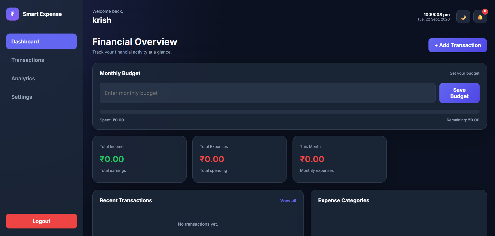

# 💰 Smart Expense Tracker

A simple and user-friendly web application to track income, expenses, budgets, and financial activity in one place.

## 🚀 Features

- 💰 Track total income
- 💸 Track total expenses
- 📊 Financial overview dashboard
- 🧾 Add and manage transactions
- 🎯 Set monthly budget
- 📈 Expense category analysis
- 🕒 Recent transaction tracking
- 🌙 Dark mode interface
- 🔔 Notification support
- 📱 Clean and responsive UI

## 📸 Dashboard Preview



## 🛠️ Technologies Used

- HTML5
- CSS3
- JavaScript

## ⚙️ How to Run

1. Clone or download this repository.
2. Open the project folder.
3. Open `index.html` in your browser.
4. Start tracking your expenses.

## 📂 Project Structure

```text
smart-expense-tracker/
├── index.html
├── style.css
├── app.js
├── dashboard.png
└── README.md
